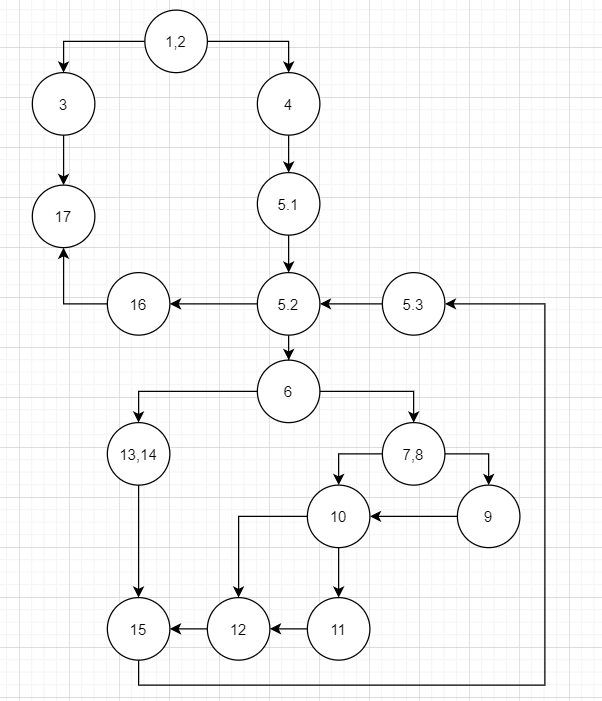

# Втора лабораториска вежба по Софтверско инженерство
## Галина Душански, бр. на индекс 183042
### Група на код:
Ја добив групата на код 5
### Control Flow Graph

### Цикломатска комплексност
Цикломатската комплексност на овој код е 5, истата ја добив со формулата E-N+2,каде бројот на ребра е 20, бројот на јазли е 17. 
20-17+2=5 
За да ја потврдам истата проверка правам и со формулата P+1, каде P е бројот на предикатни јазли и истиот изнесува 4. 
4+1=5 (јазлите се: 1,2, 6, 7,8 и 10) 

### Тест случаи според критериумот Every statement

    Помошни листи кои ги користам за тестовите:
    List<String> list1 = Arrays.asList(); //ТЕСТ СЛУЧАЈ 1 (ПРАЗНА ЛИСТА)
    List<String> list2 = Arrays.asList("0","#","0","#","#","0"); //ТЕСТ СЛУЧАЈ 2
    List<String> rez2 = Arrays.asList("1","#","2","#","#","1"); //резултат на вториот тест случај
    
    Тестовите:
    @Test
        void everyStatementTest() {
            IllegalArgumentException ex;
            ex = assertThrows(IllegalArgumentException.class, () -> SILab2.function(list1));
            assertTrue(ex.getMessage().contains("List length should be greater than 0"));
            assertTrue(SILab2.function(list2).equals(rez2));
    }

### Тест случаи според критериумот Every path
    
    Помошни листи кои ги користам за тестовите:
    List<String> list1 = Arrays.asList(); //ТЕСТ СЛУЧАЈ 1 (ПРАЗНА ЛИСТА)
    List<String> list3 =Arrays.asList("0","#","0","#","#","0","0"); //ТЕСТ СЛУЧАЈ 2
    List<String> rez3 =Arrays.asList("1","#","2","#","#","1","0"); //резултат на вториот тест случај
    
    Тестовите:
    @Test
    void testEveryPath() {

       //1,2, 3, 17
        IllegalArgumentException ex;
        ex = assertThrows(IllegalArgumentException.class, () -> SILab2.function(list1));
        assertTrue(ex.getMessage().contains("List length should be greater than 0"));

        //1,2, 4, 5.1, 5.2, 16, 17 -ne moze da se sluci

        //1,2, 4, 5.1, (5.2, 6, 13, 14, 15, 5.3, 5.2), 16, 17
        //1,2, 4, 5.1, (5.2, 6, 7,8, 10, 12, 15, 5.3, 5.2), 16, 17
        //1,2, 4, 5.1, (5.2, 6, 7,8, 10, 11, 12, 15, 5.3, 5.2), 16, 17
        //1,2, 4, 5.1, (5.2, 6, 7,8, 9, 10, 12, 15, 5.3, 5.2), 16, 17
        //1,2, 4, 5.1, (5.2, 6, 7,8, 9, 10, 11, 12, 15, 5.3, 5.2), 16, 17

        assertTrue(SILab2.function(list3).equals(rez3));
      }
      
### Објаснување на напишаните unit tests
Тестовите кои се според критериумот Every statement, треба да ги поминат сите наредби. Првиот тест случај ми проверува дали кога
листата е празна, се фрла точниот исклучок и точната порака. Вториот тест случај ми проверува дали сите услови и јамки се извршуваат точно со
што се добива точен излез од програмата. Тестовите ги поминуваат сите јазли од CFG што значи сме ги провериле сите наредби.

Тестовите кои се според критериумот EveryPath, треба да ги поминат сите патеки во CFG. Првиот тест случај ми ја проверува патеката 1,2, 3, 17 која 
се случува само тогаш кога листата што се праќа на функцијата е празна и програмата фрла исклучок. Втората патека 1,2, 4, 5.1, 5.2, 
16, 17 не може да се случи поради тоа што во for циклусот не може да влезе листа која е празна, па минимум еднаш би се извршил истиот. 
Вториот тест случај ми ги проверува останатите патеки (напишани погоре), кои влегуваат во for циклуцот, исполнувајќи различни усови и давајќи
нормален излез од прогрмата.
